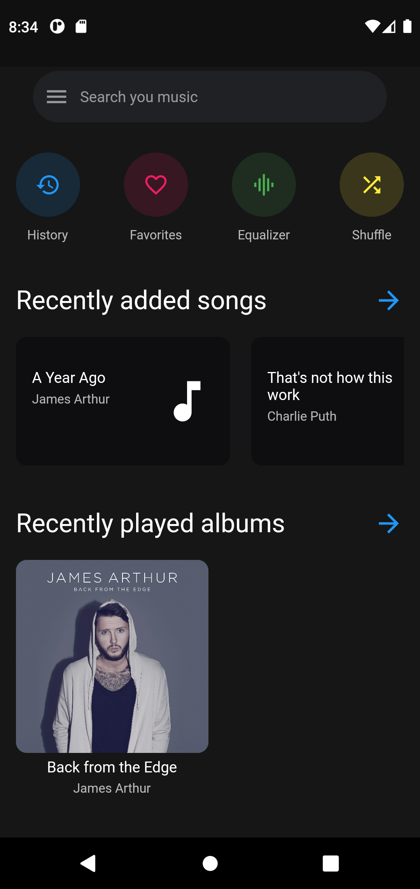
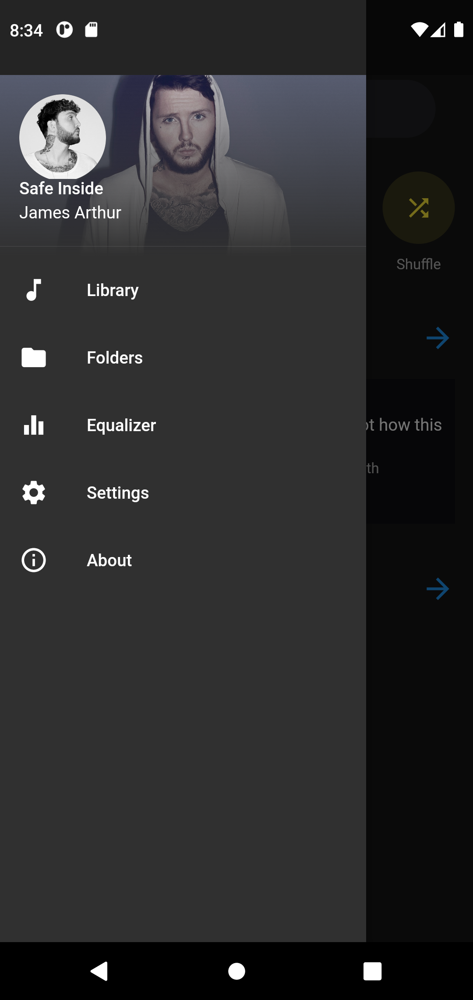

# Flutter Music App

This is a Flutter app showcasing the UI for a music app with two main screens - Home Page and Home Drawer.

## Features

1. **Home Page:** This screen displays a list of music albums, songs, or playlists available in the app. Users can scroll through the list to explore different music options.
2. **Home Drawer:** The Home Drawer provides a convenient navigation panel for the app. It may contain links to different sections of the app, user settings, and other related options.

## Screenshots




## Requirements

- Flutter SDK (follow the official guide to install: https://flutter.dev/docs/get-started/install)
- Any compatible IDE (Android Studio / VSCode / IntelliJ)

## Getting Started

1. Clone this repository to your local machine using:

   ```bash
   git clone https://github.com/letscodecraft/flutter-music-app.git